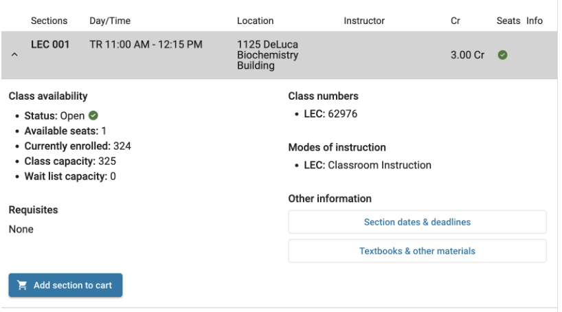

# Get a notification email when Class is no longer closed
## Introduction
<h3>Tired about checking the course search and enroll again and again? Let's go with a simple web scraper!</h3>
<h4>Get an email notification when class is not longer closed (best for classes without waitlist)</h4>
ex: I am using for genetics 133 in this case. Enroll the course successfully when testing the code!

  
  

<h4>Or you can check how many people have already been in waitlist</h4>

## Process
* Using https://public.enroll.wisc.edu/search, the website is for General Public to search UW-Madison courses – Public Course Search & Enroll application. There is no login required.
* Using gmail as the platform to send email. Reference to https://stackoverflow.com/questions/16512592/login-credentials-not-working-with-gmail-smtp.
* The check is happened every hour. Using schedule to do work every hour. Reference: https://schedule.readthedocs.io/en/stable/examples.html

## Files
* simpleAPI.py: simple GET request for https://public.enroll.wisc.edu/api/search/v1/enrollmentPackages/. Get response as JSON and parse it as dictionary.
* sendEmail.py: add sendEmail function to the simpleAPI
* checkHour.py: add schedult to send the request per hour until there is open seat or it is terminated by keyboard interrupt
* getWaitNum: a side function to check how many people have already been in waitlist
